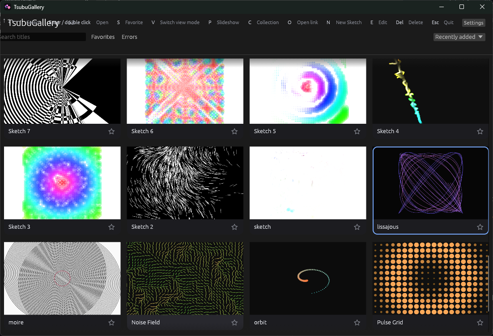

# TsubuGallery

English · [日本語](README.ja.md)

A cross-platform gallery for storing, running and watching つぶやきProcessing
sketches — Processing written short enough to fit in a post.



What changed in each release is in [CHANGELOG.md](CHANGELOG.md). See
[`docs/TsubuGallery_Design.md`](docs/TsubuGallery_Design.md) for the design
(written in Japanese). This repository implements all of **Prototypes A–E** from
§29 of that document.

| Prototype | Goal | Status |
|---|---|---|
| A | Draw a fixed sketch fullscreen at 60 fps in Rust | Done |
| B | Keep several sketches resident and switch instantly | Done |
| C | Grab frames from the same renderer and save them as images | Done |
| D | Pick a sketch from a grid and open the viewer | Done |
| E | Run Processing Lite code through parser → bytecode | Done |

Phase 7 (SQLite, favourites, tags, search) is in as well.

```text
Gallery → pick a sketch → Fullscreen Viewer → Esc → Gallery
   │
   └→ N new / E edit → Editor → ⌘S save → compile → Gallery
```

## Running it

```sh
cargo run --release
```

On first launch the bundled sketches are written into the data directory and
appear in the gallery. Drop more `.pde` files there to add your own.

### Controls

**Gallery**

| Key | Action |
|---|---|
| `↑` `↓` `←` `→` | Move the selection |
| `Home` / `End` | First / last |
| Click | Select |
| `Enter` / `Space` / double click | Open in the viewer |
| `R` | Open a random sketch |
| `N` | New sketch |
| `E` | Edit the selected sketch |
| `Delete` / `Backspace` | Delete the selected sketch — or every marked one — after confirmation |
| `S` / click the star | Favourite |
| `T` | Regenerate the selected thumbnail |
| `V` | Cycle the view mode (grid → large cards → list) |
| `C` | Add or remove the sketch from collections |
| `O` / click ↗ | Open the link in a browser |
| `P` | Start / stop the slideshow |
| `Ctrl`+click | Mark the sketch (multi-select); `Shift`+click marks a range, `Ctrl`+`A` marks everything shown |
| `X` | Export the marked sketches (or the selected one) to a JSON file |
| `I` | Import sketches from an exported JSON file |
| `Ctrl`+`C` | Copy the marked sketches (or the selected one) to the clipboard as export JSON |
| `Ctrl`+`V` | Paste: sketches from copied JSON, or a new sketch whose source is the clipboard text |
| Search box | Substring match on title and id |
| `F` / `F11` | Fullscreen |
| `L` | Switch the UI language |
| `,` / **Settings** button | Settings |
| `Esc` | Clear marks, leave fullscreen, then quit |

**Viewer** (design §8.1)

| Key | Action |
|---|---|
| `→` / `PageDown` | Next sketch |
| `←` / `PageUp` | Previous sketch |
| `Space` | Pause / resume |
| `↑` / `↓` | Playback speed up / down (0.25× – 4×) |
| `P` | Start / stop the slideshow |
| `R` | Random |
| `T` | Update the thumbnail |
| `E` | Edit this sketch |
| `I` | Info overlay (author / link / fps / playback speed / sketch clock / **CPU load** / sketch time / instructions and triangles per frame / frameCount / switch time) |
| `O` | Open the link in a browser |
| `F` / `F11` | Fullscreen |
| `L` | Switch the UI language |
| `Esc` | Leave fullscreen, or go back to the gallery |

**Editor**

| Key | Action |
|---|---|
| `⌘S` | Save and compile |
| `⌘Enter` | Save and run |
| `⌘F` | Expand (add newlines and indentation) |
| `⌘K` | Compress (strip whitespace and comments) |
| `Esc` | Close (asks if unsaved) |

`⌘` and `⌥` are the macOS labels. On Windows and Linux they become `Ctrl` and
`Alt`, and the on-screen hints show those instead.

Editing itself:

| Key | Action |
|---|---|
| `Enter` | Newline, indented to match the previous line. One level deeper after `{` |
| `Tab` / `Shift+Tab` | Indent / outdent the selected lines |
| `⌘/` | Toggle comments on the selected lines |
| `⌘D` | Duplicate the line |
| `⌥↑` / `⌥↓` | Move the line up or down |
| `⌘Z` / `⌘⇧Z` | Undo / redo |

Clicking the error message at the bottom jumps the cursor to that line.

The code pane has line numbers and syntax colouring for Processing Lite: types,
keywords, API functions, built-in variables, numbers and comments are told
apart. A line that failed to compile gets a red background and line number.

The vocabulary used for colouring (keywords and API names) is read from the same
lexer and `natives` table the runtime uses, so adding a word to the language also
colours it. A test pins the two together so they cannot drift.

#### Checking as you type

You do not have to save. When your hands stop for 0.4 s the code is compiled in
the background and failing lines turn red. Nothing touches the file or the
running sketch, so a typo never stops the picture that is already on screen.
A compile takes 30–45 µs for the bundled sketches, well inside one frame (16 ms).

#### Telling the dialects apart

When a compile fails, the editor says which dialect it read the code as and
lists what that dialect **does not support yet**, with line numbers. Showing only
an error position gives you nothing to act on.

```text
Read as p5.js, but some of it is not supported.
  line 2  API we do not have yet
  line 2  strings
```

The guess is only a guess, so **code that compiles is never commented on**.

#### Expand and compress

`#つぶやきProcessing` is usually folded onto one line to
save characters. **Expand** to read it, **compress** to post it. The character
count is always shown at the bottom of the editor.

```processing
// compressed (207 chars)
int t;void setup(){size(400,400);}void draw(){background(0);for(int i=0;i<100;i++){
float a=i*.1+t*.01;float r=i*2.;noStroke();fill(255,i,255-i);circle(200.+r*cos(a),
200.+r*sin(a),4.);}if(t>100)t=0;else t++;}
```

```processing
// expanded
void draw() {
  background(0);
  for (int i = 0; i < 100; i++) {
    float a = i * 0.1 + t * 0.01;
    ...
  }
  if (t > 100)
    t = 0;
  else
    t++;
}
```

Expanding breaks lines at statement boundaries, indents, and then **wraps any
line longer than 96 columns inside its brackets**. A compressed sketch can have a
single statement hundreds of characters long, which is unreadable even after
indenting.

```js
// before wrapping (150 chars)
a = (y, d = mag(k = (5 + sin(y * 2 - t / 2) * 2) * cos(i / 29), e = y / 7 - 13) - 6) => point(…)

// after
a = (
  y,
  d = mag(k = (5 + sin(y * 2 - t / 2) * 2) * cos(i / 29), e = y / 7 - 13) - 6
) => point((q = 3 * sin(k * 2) + cos(y)) * d + w, (cos(e) + sin(k)) * d + w)
```

It picks the outermost bracket group and splits on the commas inside it, then
recurses into pieces that are still too long. Brackets inside comments are not
counted. A single blank line from the original is kept.

Compressing removes whitespace and comments and shortens numbers (`0.5` → `.5`,
`1.0` → `1.`, `2.0f` → `2.`). It never shortens in a way that changes the type
(`1.0` → `1`), and it **does not rename variables**, so it will not get as small
as code golfed by hand.

Neither direction reorders tokens, so meaning is preserved. Tests pin that the
bytecode is identical before and after for every bundled sketch, and that a round
trip is stable. Even for code that does not parse, the token sequence is
guaranteed unchanged.

つぶやきGLSL is formatted the same way. Statement separators and brackets work
alike in every C-family language, so the dialect does not have to be told apart.
The exception is a line starting with `#`: a preprocessor directive such as
`#version` only works if it stays on one line, and a tag such as `#つぶやきGLSL`
should be left exactly as written. Both are passed through as whole lines.

The viewer's control overlay fades out after 2.6 s without input (§8.2).

### Adding, editing and deleting sketches

Press `N` in the gallery to start a new sketch from a template. The name is
chosen so it does not clash (`sketch`, `sketch-2`, …) and can be changed above
the code pane. Saving writes `<data>/sketches/<name>.pde`.

Saving recompiles on the spot and regenerates the thumbnail. **The file is always
written even if compilation fails** — you should never lose what you typed. The
running instance keeps going with the last good code (design §15.1: "on a syntax
error, keep the last good cache").

Deleting cannot be undone, so it always asks first. Both the `.pde` and the
thumbnail are removed. Deleting a bundled sketch does not bring it back on the
next launch (the bundled set is only written out when the library is empty).

Files placed from outside the app are picked up the same way. You are free to use
your own text editor instead of the built-in one.

### Finding and organising (design §20)

The top of the gallery filters and sorts.

| Control | Effect |
|---|---|
| Search box | Substring match on title, id and author (case insensitive) |
| Favourites | Only starred sketches |
| Errors | Only sketches that fail to compile |
| Tags | Only sketches with the chosen tag |
| Sort | By name / recently added / recently opened |

Tags are typed comma-separated in the editor's **Tags** field. They show at the
bottom right of the card and become filter choices.

### Author and link

Filled in from the editor's **Author** and **Link** fields. They are not in the
table in design §19.1, but for つぶやき work it matters whose post a sketch
came from. The author shows at the bottom right of the card, in the list view and
in the viewer's info overlay (`I`), and the search box matches it.

`O`, or the ↗ button in the list view, opens the link in the default browser.

**Only `http://` and `https://` are opened.** A link arrives together with the
sketch and is handed to an external program, so allowing `file:` or `javascript:`
would let whoever distributed the sketch make something happen on the machine of
whoever received it. Links containing whitespace or control characters are
refused too, so no argument boundary can be forged. Links that cannot be opened
get no button.

On Windows, `cmd /C start` is not used: cmd would interpret `&` in the URL
itself. `rundll32 url.dll,FileProtocolHandler` is used instead.

Sketch code cannot open a link. It only happens when you press the button
(design §21's sandbox is untouched).

Favourites, tags, creation time and last-opened time survive a restart.

### Generating every thumbnail at once

Runs every sketch without opening a window and writes images. Also usable as a
rendering smoke test in CI.

```sh
cargo run --release -- --capture-all ./out
```

### Export and import (design §27)

Mark sketches with `Ctrl`+click, `Shift`+click (a range) or `Ctrl`+`A`
(everything shown by the current filter); the header counts them. `X` then
writes the marked sketches — or just the selected one
when nothing is marked — to a single `*.tsubu.json` chosen in the OS save
dialog. Each entry carries the id, title, author, link, tags, favourite flag
and the source. Thumbnails are not included; they are regenerated on import.

`I` opens an exported file and lists its sketches with name,
author and tags. Tick the ones to bring in and press **Import** (or `Enter`).
A sketch whose id is already taken is added under a new name (`spiral-2`) and
never overwrites what is there; the list says so next to the id. Imported
sketches are compiled, saved to `<data>/sketches/`, and get their metadata and
a fresh thumbnail.

```json
{ "app": "TsubuGallery", "format": 1, "exported_at": 1788048000,
  "sketches": [ { "id": "spiral", "title": "Spiral", "author": "", "link": "",
                  "tags": ["abstract"], "favorite": false, "source": "…" } ] }
```

### Copy, paste and bulk delete

`Ctrl`+`C` puts the marked sketches (or the selected one) on the clipboard in
the same JSON as an export, so a sketch can be duplicated with `Ctrl`+`V`, or
carried to another data directory or machine through any text channel.
`Ctrl`+`V` with anything else on the clipboard — a tweet's code, say — makes a
new sketch named `pasted`, `pasted-2`, … from that text. Pasted sketches take
new names when theirs are taken, like an import.

`Delete` with marks set asks once ("N sketches") and then removes them all,
files, thumbnails and metadata alike.

### Storage location

The data directory (sketches, thumbnails, `library.sqlite3`, logs) can be moved
from **Settings → Data → Storage location**, which opens the OS folder picker.
The choice is written to `config.json` in the *default* data directory — it has
to live somewhere that does not move — and takes effect on the next launch.
Existing files are not moved; copy them by hand if you want them in the new
place. **Use default** removes the override. `TSUBU_DATA_DIR` still wins over
the setting, and the settings screen says so when it is set.

### Environment variables

| Variable | Effect |
|---|---|
| `TSUBU_DATA_DIR` | Use a different data directory (overrides the setting) |
| `TSUBU_START_SCREEN` | Override the start screen: `gallery` / `viewer` / `editor` / `settings`. Without it, the setting is used |
| `RUST_LOG` | How much to log. `warn` by default (see "Logs") |

```text
<data>/
  sketches/          sketches (*.pde) — the source of truth
  thumbnails/        <id>.png
  library.sqlite3    metadata (favourites / tags / collections / settings)
  instance.lock      running marker (see "Single instance" below)
  cache/             bytecode cache (unused; see "Deferred optimisation")
  logs/tsubu.log     run log (see "Logs")

<default data>/
  config.json        where the data directory is (only when changed in Settings)
```

### Logs

Appended to `<data>/logs/tsubu.log`; the same records go to stderr. Past 1 MiB
the file moves to `tsubu.log.1` … `tsubu.log.3` and the oldest is dropped.
Deleting the logs changes nothing about how the app runs.

People are not the only readers. So that **an editor or an outside agent can
read it and find what to fix**, there is one record per line, every line starts
with `time level kind`, and lines about a sketch (kind `sketch`) carry
`key=value` pairs. A value is quoted only when it contains a space or a quote.

```text
2026-08-14T12:23:27.795Z ERROR sketch id=broken phase=compile dialect=p5.js line=2 column=7 file=D:/data/sketches/broken.pde message="rotate は引数 1 か 2 か 4 個で呼びます (3 個渡されています)"
```

| Key | Meaning |
|---|---|
| `id` | The sketch identifier, which is also its `.pde` file name |
| `phase` | `compile` (at load) / `run` (stopped while playing) / `thumbnail` |
| `dialect` | `Processing` or `p5.js`; a guess on lines where compiling failed |
| `line` `column` | Where in the source, when known |
| `file` | The file to fix. Separators are normalised to `/` |
| `message` | Why |

Times are UTC. Paths use `/` because `\` would need escaping inside quotes and
reads badly; Windows opens either.

**Levels** are chosen so that a reader can take `ERROR` alone and have the work
list.

| Level | Meaning |
|---|---|
| `error` | Something asked for did not happen and **there is a place to fix** — a sketch that will not compile, a run cut short, a thumbnail that could not be made, a sketch file that could not be read |
| `warn` | Usable but not as intended: a font is missing, a setting could not be read and the default was used |
| `info` | Ordinary progress. **Not emitted by default** |
| `debug` | Fine-grained tracing |

Because the default is `warn`, anything in the log is something to look at. For
ordinary progress use `RUST_LOG=info`, and for per-sketch instruction counts
`RUST_LOG=tsubugallery=debug`.

Panics land in the log too, as `ERROR panic`, with the location and the reason —
so a crash can be followed up without reproducing it.

```sh
# just the things to fix
grep 'ERROR sketch' ~/.local/share/TsubuGallery/logs/tsubu.log
```

### Single instance

Only one process may open a given data directory. Opening it twice makes SQLite
writes contend and generates thumbnails twice over. The second one explains
itself and exits with status 1.

```console
$ tsubugallery
TsubuGallery is already running. (pid 35013)
Only one instance at a time. Set TSUBU_DATA_DIR to open a separate data directory.
```

`--capture-all` is treated the same way, since it writes to the same place.

The mechanism is an OS file lock on `instance.lock`
(`std::fs::File::try_lock`). **It is always released when the process dies**, so a
forced kill does not block the next launch. Not having to decide whether a PID
file is stale is exactly why this was chosen. The PID written into the file is
only there for a human to read.

Different data directories run side by side, so `TSUBU_DATA_DIR` lets you compare
two builds at once.

Where the lock cannot be taken (a data directory that is not writable, say) the
app warns and starts anyway.

### When it cannot start

If the window cannot be created, or no GPU can be prepared, the reason goes into
**an OS dialog** before the app quits. The same line lands in the log.

The dialog is there because staying quiet tells the user nothing. The window is
created before the GPU is, so without it you would only see an empty window
flash and vanish. Writing to stderr does not help either: launched from a
shortcut, the console closes together with the process.

For the GPU part, wgpu considers Vulkan, DX12 and OpenGL. On Windows a missing
Vulkan just falls through to DX12, so stopping here means no working graphics
driver at all.

### Settings (design §24)

Open with `,` or the **Settings** button at the top right of the gallery.
Changes take effect immediately and are written to the `setting` table in
`library.sqlite3`.

| Group | Items |
|---|---|
| General | Language / theme (dark, light) / start screen |
| Gallery | View mode / card size / sort order / show titles |
| Viewer | Open fullscreen / **canvas fit** / frame rate / playback speed / next-sketch order / preload neighbours / slideshow interval / screensaver |
| Thumbnail | Capture frame / image quality |
| Runtime | Per-frame instruction limit |
| Data | Storage location (see "Storage location"; kept in `config.json`, not the DB) |

**Canvas fit** decides what happens when a sketch declares a canvas whose shape
does not match the window. つぶやき sketches are usually square, so a wide
window leaves a band of empty space on each side. *Contain* (the default) keeps
the whole canvas visible; *Cover* scales it up until the window is full and lets
whatever overflows fall outside. The setting applies to thumbnails as well, so a
gallery card and the viewer show the same framing.

Both keys and values are language-independent ASCII. Unreadable values fall back
to the default, so hand-editing the table cannot stop the app from starting.

### What `I` shows

`I` opens a panel over the viewer with what the current sketch actually costs.

| Row | Meaning |
|---|---|
| CPU load | Share of wall-clock time the main thread spends working, with the two times behind it: `work / interval`. Waiting for the display is not work, so a sketch that finishes early reads low. It stops at 100% — one thread cannot do more |
| Sketch time | How long `draw()` took: the VM plus building the geometry |
| Instructions/frame | Bytecode instructions the sketch executed. The per-frame budget (Settings → Runtime) is measured in these |
| Triangles/frame | What the GPU was handed |
| Sketch clock | Seconds elapsed as the sketch sees them, accumulated at the playback speed. This is GLSL's `t` |
| GPU | Name of the adapter wgpu picked |
| Backend | Something like `Vulkan · DiscreteGpu`: which API, and which kind of GPU |

Together the first four say where a slow sketch is slow. A high instruction count
with few triangles is the language being asked to do too much; the reverse is the
renderer.

The last two rows never change between sketches, which is why they sit at the
bottom. On a machine carrying both an integrated and a discrete GPU, which one
got picked is worth several times the frame rate — it is the first thing to look
at when someone reports that things are slow. The same line goes into the log at
startup, with the driver version as well (`RUST_LOG=info`).

### The cursor in fullscreen

Three seconds without input in fullscreen and the mouse cursor disappears; moving
it brings it back. A stationary arrow starts to look like part of the sketch.

It goes slightly after the overlay (2.6 s). Losing both at once makes it hard to
read what just happened.

**The cursor is left alone when it is not over our window.** Fullscreen or not,
a second monitor lets the cursor walk off this screen, and hiding it there would
take the cursor away from someone who is working in another application.

Hiding is done by asking egui for `CursorIcon::None` rather than calling
`window.set_cursor_visible(false)`: egui-winit calls `set_cursor_visible(true)`
every frame, so the direct route turns into a tug of war.

### Playback speed

`↑` / `↓` steps through five settings from 0.25× to 4×. It is also in Settings,
and the choice is saved.

It is not the frame rate setting (30 / 60 fps).

| | What it decides |
|---|---|
| Frame rate | How many times per second the frame is drawn |
| Playback speed | How many real seconds one sketch second takes |

The viewer accumulates each sketch's clock itself rather than reading the wall
clock, so:

- `Space` freezes a GLSL sketch's `t` too
- `R`, or saving an edit, restarts it from zero
- it does not run on while you are looking at another sketch

Thumbnails are always captured at 1×, regardless of the setting, so the same
sketch always yields the same image (design §7.1).

### View modes (design §6.2)

Three ways to lay out the list. `V` cycles them, and the choice is saved.

| Mode | Description |
|---|---|
| Grid | Default. 2–10 columns depending on window width |
| Large cards | Up to 3 columns. One sketch shown big, with bigger text |
| List | One row per sketch. Dialect, tags and errors sit beside the image instead of on top of it |

The column count is also the step size for the up/down keys, so every mode
reports the number it actually used (the list reports 1). The other four items
§6.2 lists — favourites only, by tag, recently added, random — are already
covered by filtering and sorting (§20).

### Playback — slideshow and screensaver (design §27)

`P` starts advancing automatically. The interval is 2–120 s in the settings, and
the order follows the "next sketch" setting (in order / random).

**The playlist is whatever the gallery is showing.** There is no separate queue;
it walks the visible list in its current order. Filter to favourites, to a tag,
or to a collection, then press `P`, and that is your playlist. The arrow keys
move within the same range.

The screensaver turns on once you pick an idle time in the settings (off by
default). After that much time without input, a fullscreen slideshow starts; any
input restores the previous screen and fullscreen state. Nothing is overlaid
while it runs, and the keystroke that dismisses it is not passed on to the
screen, so you cannot accidentally delete a sketch waking it up.

It never starts while editing or in the settings, since you may simply be reading
the screen.

### Collections (design §27)

Select a sketch and press `C`. Ticking a box takes effect immediately. Typing a
new name and pressing **Add** creates that collection and puts the sketch in it.

A collection selector appears in the filter bar (hidden when there are none).
Choosing one narrows the list, and `P` then plays that collection.

Deleting a collection does not delete sketches. Deleting a sketch removes its
memberships (`ON DELETE CASCADE`). Renaming a sketch carries them along
(`ON UPDATE CASCADE`).

### Files are the source, the database is metadata

Design §19.1 puts `source` in the `Sketch` table too. Here the `.pde` file is the
source of truth and the database holds only the other columns. Three reasons:

- You can use any editor. Sketches are short text; needing the app to touch them
  would be the bigger inconvenience
- A corrupted database never costs you your sketches. Only the extras have to be
  rebuilt
- The same reasoning that keeps thumbnails out of the database (§7.3) applies to
  the source

At startup the file listing and the database are reconciled: new files get a row,
and rows for files deleted outside the app are dropped. Sketches still run if the
database cannot be opened (you just lose favourites and tags).

### A sketch keeps its own drawing state

The viewer holds every sketch instantiated at once so that switching does not
restart anything (design §18), but the whole gallery shares one `Graphics`. That
combination has a trap in it: a sketch's `setup()` runs exactly once, so anything
it decides — `stroke(-1)`, `size()`, `colorMode(HSB)`, `textSize()`, whether the
canvas is 3D — is gone for good the moment the shared state is reset for someone
else. A sketch whose only white is set in `setup()` and whose `draw()` starts
with `clear()` then paints black on black, and the screen simply stays dark.
Preloading made it worse, because it runs `setup()` against a *different*
`Graphics` altogether.

So each sketch's state is parked (`GraphicsState`) when you switch away and put
back when you return, and the preloader parks what it warmed up. Only the
per-frame scratch — the matrix stack, an unfinished `beginShape()` — is dropped.

The canvas itself is another matter: switching and resizing both throw the
accumulated image away, and there is only one of it to go around. A sketch that
clears every frame does not care. One that leans on what is already there does —
static-mode sketches, and the `f++ || background(0)` idiom that paints the
ground on the very first frame and never again. Those are run from the top when
the canvas goes, because otherwise they carry on drawing white lines onto a
white page. Whether a sketch leans on the canvas is not guessed from its source:
it is simply whether its last frame cleared.

### The canvas persists across frames

If `draw()` does not call `background()`, the previous frame stays on screen,
matching Processing and p5.js. The staple of つぶやきProcessing —

```java
void draw() {
  background(0, 12);   // translucent wash → trails
  circle(...);
}
```

— and the style that never calls `background()` at all both come out the way they
do in the real thing.

Something has to give the accumulation back when it is thrown away, though.
Switching sketches and resizing the window both drop it, and a static-mode
sketch (design §14.1) has no `draw()` to repaint with — everything it draws
happens inside `setup()`, which runs once. Such a sketch is therefore run again
from the top whenever the canvas is discarded, with its random seed put back so
the picture is the one you saw before, and the one on its gallery card.

It is implemented with two textures used alternately
(`renderer/src/canvas.rs`). Because drawing resolves MSAA into the target, you
cannot read the previous frame while writing the same place, so the read side and
the write side are separate. Thumbnails accumulate one frame at a time up to the
target frame too, so sketches with trails look the same as when they run.

Nothing accumulates while paused. Stacking the same shapes every frame would make
a supposedly frozen picture keep darkening.

## Three dialects

Drop in a `.pde` and it runs. **Processing (Java Mode)**, **p5.js** and
**つぶやきGLSL** are all accepted, and which one it is gets detected
automatically — you never have to say (design §23.2, swappable frontends).
FragCoord.xyz's **GOLF** shorthand rides on the GLSL road: it is expanded to
つぶやきGLSL first ([GOLF](#golf-fragcoordxyz)).

```text
Processing Lite ─┐
                 ├─ AST → bytecode → VM ─┐
p5.js subset ────┘                        ├─ renderer
つぶやきGLSL     ── naga → WGSL → wgpu ───┘
GOLF ── expand ──┘
```

Everything below bytecode is shared; only the VM's value type was widened to
cover arrays, objects and functions. GLSL is the exception: it never reaches the
VM. A single fragment shader goes straight to the GPU, so it takes a different
road from the one that builds triangles ([つぶやきGLSL](#つぶやきglsl)).

## Processing Lite (Java Mode)

The supported surface follows design §14. Full Java Mode compatibility is not a
goal.

```processing
// Particles on the golden angle, slowly turning as a whole.
void draw() {
  background(10);
  float s = min(width, height);
  float t = frameCount * 0.008;

  noStroke();
  pushMatrix();
  translate(width * 0.5, height * 0.5);
  rotate(t);

  for (int i = 0; i < 320; i++) {
    float f = i / 320.0;
    float angle = i * 2.399963;
    float radius = sqrt(f) * s * 0.46;
    fill(60 + f * 190, 80 + f * 40, 255 - f * 70, 235);
    circle(radius * cos(angle), radius * sin(angle), map(f, 0, 1, s * 0.03, s * 0.004));
  }

  popMatrix();
}
```

### The language

| Category | Supported |
|---|---|
| Types | `int` `float` `boolean` `void` `String` `PVector`, 1-D arrays (`float[]` `int[]` `boolean[]` `String[]` `PVector[]`) |
| Operators | `+ - * / %`, `== != < <= > >=`, `&& \|\|` (short-circuit), `!`, ternary |
| Bitwise | `& \| ^ ~ << >> >>>` |
| Assignment | `=` `+=` `-=` `*=` `/=` `%=` `&=` `\|=` `^=` `<<=` `>>=` `++` `--` (prefix and postfix), usable inside expressions (`line(x, y, x += dx, y)`) |
| Control flow | `if` / `else` / `for` / `while` / `return` / `break` / `continue` / `switch` |
| Arrays | `new float[n]`, `new float[r][c]`, `new int[]{1,2}`, `{1,2,3}`, `a[i]`, `a[y][x]`, `a.length`, enhanced for (`for (int v : a)`) |
| Classes | `class P { ... }`, fields, constructor, methods, `this`, `new P(...)`, `P[]` |
| Vectors | `new PVector(x, y)`, reading and writing `v.x`, methods like `v.add(u)` |
| Casts | `(int)x` `(float)x` `(boolean)x` |
| Literals | decimal, hex (`0xFF6B35`), exponent (`1e3`), `1.0f`, char (`'a'` = code point), string (`"..."`) |
| Declarations | Several names in one statement, e.g. `float a = 1, b;` |
| Other | User-defined functions (recursion allowed), globals, block scope |

`int` arithmetic stays integral as in Java (`7 / 2` is `3`). Bitwise operations
coerce both sides to 32-bit integers and only look at the low 5 bits of a shift
count. Precedence matches Java too, including the trap where `a & 1 == 0` parses
as `a & (1 == 0)`.

```processing
// Classes, PVector and a 2-D array.
class Bird {
  PVector pos, vel;
  Bird(float x, float y) {
    pos = new PVector(x, y);
    vel = new PVector(random(-2, 2), random(-2, 2));
  }
  void step() { pos.add(vel); }
  void show() { circle(pos.x, pos.y, 4 + vel.mag()); }
}

Bird[] flock = new Bird[140];
float[][] grid = new float[12][12];

void setup() {
  size(600, 600);
  for (int i = 0; i < flock.length; i++) flock[i] = new Bird(random(600), random(600));
}

void draw() {
  background(12);
  for (Bird b : flock) { b.step(); b.show(); }
}
```

```processing
// Unpacking packed colours, a common idiom, works as written.
int[] pal = {0xFF6B35, 0x4ECDC4, 0xFFE66D};
float[] y = new float[64];

void draw() {
  for (int c : pal) {
    fill((c >> 16) & 255, (c >> 8) & 255, c & 255);
    for (int i = 0; i < y.length; i++) {
      if (i % 7 == 0) continue;
      if (i > 60) break;
      circle(i * 9, y[i], (int)(6 + (i & 7)));
    }
  }
}
```

`switch` falls through to the next `case` without a `break`, as in Java. That is
used deliberately when golfing, so it is reproduced. A `break` inside a `switch`
leaves only the `switch`; a `continue` reaches the enclosing loop.

Vectors are the same thing as p5's `createVector()`: `add()` and friends mutate
the receiver and return it, so `v.mult(3).add(2,0)` chains. Every element of
`new PVector[n]` is a separate instance — sharing one would move them all at
once.

`int(x)` and `float(x)` are spelled like type names but can be called as
functions. They are distinct from the cast `(int)x`; a following `(` is what
tells them apart.

Class methods are compiled as ordinary functions taking `this` as their first
argument, and are attached to each instance as properties. Inside a method, a
bare field name means `this.x`.

Arrays go up to two dimensions. Each row of `new float[r][c]` is a separate
array; sharing one would make a write to one row hit every row.

**Not supported**: arrays beyond 2-D, inheritance, `static`, imports.

### Static mode

A sketch with neither `setup()` nor `draw()` — just statements at the top level —
runs too. The whole thing becomes the body of `setup()` and is drawn once, as in
Processing. Short つぶやき sketches are often written this way.

```processing
float r, i, d;
size(720, 720);
strokeWeight(2);
for (d = 960; d > 9; d -= 80)
  for (r = 0; r < TAU; r += PI / d * 5) {
    resetMatrix();
    translate(cos(r) * d / 2 + 360, sin(r) * d / 2 + 360);
    ...
  }
```

Sketches that never call `background()` get the ground their dialect gives them:
Processing's grey (204), or white for p5.js, whose canvas is transparent over a
white page. It is not cosmetic. A sketch that piles up translucent fills never
quite reaches full saturation, so the ground colour is what the whole picture's
lightness is built on — grey under a p5 sketch turns a pastel wash into a
muddy one. Black would be wrong for both: this kind of sketch is drawn with the
default black stroke and would be invisible.

### API (design §14.2)

| Category | Functions and variables |
|---|---|
| Screen | `size()` / `createCanvas()` (the declared canvas is scaled to fit), `width` `height` `frameCount`, and `windowWidth` / `windowHeight` for the display area itself (`innerWidth` `innerHeight` `displayWidth` `displayHeight` mean the same here) |
| Basic shapes | `point() line() rect() ellipse() circle() triangle()`. P3D / WEBGL also supports `point(x,y,z)` and six-argument `line()`. A 5th argument onwards rounds `rect()` corners, and `rect(x, y, w)` is a square as in p5. `point()` is a round dot and thick lines get round ends, as in both originals |
| Free-form shapes | `beginShape() vertex() curveVertex() bezierVertex() endShape()`, `arc() quad() bezier() curve()`. P3D / WEBGL `vertex(x,y,z)` retains depth |
| Text | `text() textSize() textAlign() textWidth()`, `str() nf()`, `String.fromCodePoint()` |
| Shape modes | `rectMode() ellipseMode() angleMode()`, `square()` |
| Vectors | `createVector()`, `add sub mult div set copy mag magSq normalize limit setMag heading rotate dist dot cross lerp angleBetween` |
| Vectors (static) | `p5.Vector.random2D random3D fromAngle add sub mult div lerp cross normalize dot dist mag angleBetween`. These leave their arguments alone and return a new vector |
| Looping | `noLoop() loop()` `clear()` |
| Colour values | `color() lerpColor()`, components `red() green() blue() alpha() hue() saturation() brightness()` |
| Colour and stroke | `background() fill() stroke() noFill() noStroke() strokeWeight()` |
| Transforms | `translate() rotate() scale() pushMatrix() popMatrix() pushStyle() popStyle() resetMatrix()`. `translate()` and `scale()` also take 3 arguments, `rotate()` takes `(angle, x, y, z)` and p5's `(angle, [x, y, z])` |
| 3D | `size(w, h, P3D)`, `box() sphere() sphereDetail() rotateX() rotateY() rotateZ() lights() noLights()`. `sphere(r, longitude, latitude)` changes the detail for that one sphere |
| Accepted, ignored | `smooth() noSmooth()`. The renderer always antialiases, so the call is taken and does nothing |
| Maths | `sin() cos() tan() atan() atan2() asin() acos() abs() min() max() map() norm() constrain() sqrt() sq() pow() exp() log() floor() ceil() round() dist() mag() lerp() radians() degrees() int() float() hypot() sign() cbrt() log2() log10()`. `dist()` and `mag()` support both 2-D and 3-D forms |
| Random and noise | `random() randomGaussian() noise() randomSeed() millis()`. `randomGaussian()` also accepts a mean and standard deviation |
| Input | `mouseX` `mouseY` `mousePressed` `keyPressed` |
| Constants | `PI` `TWO_PI` `TAU` `HALF_PI` `QUARTER_PI` `RGB` `HSB` `CLOSE` `POINTS` `LINES` `TRIANGLES` `TRIANGLE_STRIP` `TRIANGLE_FAN` `QUADS` `QUAD_STRIP` `CORNER` `CORNERS` `CENTER` `RADIUS` `DEGREES` `RADIANS` `LEFT` `RIGHT` `TOP` `BOTTOM` `BASELINE` |

`background()`, `fill()` and `stroke()` switch on argument count exactly as
Processing does. **In Processing a single `int` argument is read as a packed
colour** (`0xAARRGGBB`), so `stroke(-1)` is opaque white. Processing decides this
by type, and so does this — `fill(128.0)` is still a grey level.

p5.js has no such rule, so the reading depends on the dialect. There, a lone
number is always a grey level and is clamped: `stroke(500)` is white and
`stroke(-1)` is black. Applying Processing's rule to a p5 sketch turns
`stroke(500)` into `0x0001F4` — alpha zero, and nothing is drawn at all.

`clear()` discards what has been drawn. Processing makes the canvas transparent;
here it is filled with black instead, because a transparent thumbnail would show
through and hide a sketch drawn in white lines. On screen it is composited over
black anyway, so it looks the same.

`beginShape()` fills concave shapes correctly. Fanning the vertices would spill
outside the notches, so ear clipping is used instead.

`QUADS` **closes** every group of four points into its own quad. Joining them
into one polygon would leave no stroke where two faces meet, and the outline of
a ribbon or a mesh disappears. `QUAD_STRIP` takes the points two at a time as
cross-sections of a ribbon; each neighbouring pair makes one quad.

Colours can also be written as text: the CSS colour names (147 of them) as in
`fill('cyan')`, and `#rgb` `#rgba` `#rrggbb` `#rrggbbaa` hex. As in p5.js a
textual colour ignores `colorMode()` — it is always read as CSS. A second
argument still adds opacity, and that one is measured against the `colorMode()`
maximum.

`arc()` takes a seventh argument for how the shape closes, as in both originals.
`OPEN` (the default) and `CHORD` close the fill with a straight chord between
the two ends; `PIE` closes it through the centre, giving a wedge. The stroke is
the arc alone for `OPEN`, plus the chord for `CHORD`, plus both radii for `PIE`.

`angleMode(DEGREES)` applies to the trigonometric functions, their inverses,
`rotate()` and `arc()` alike. `rectMode()` affects `rect()` and `square()`, and
`ellipseMode()` affects `ellipse()` (`circle()` is always centre-based, as in
Processing).

`noLoop()` stops `frameCount` and skips further VM execution, geometry
generation, and GPU uploads. If the OS asks for a repaint, the retained canvas
is presented again without rerunning the sketch. This keeps a sketch that draws
once from random numbers stable while also avoiding redundant work. `loop()`
resumes frame generation.

`noise()` follows Processing's own implementation: a random table sampled with
cosine interpolation, stacked over 4 octaves at 0.5 falloff (Processing's
`noiseDetail(4, 0.5)` default). Two habits of it matter and are reproduced.
**Negative coordinates are folded** — `noise(-3, 0)` equals `noise(3, 0)` — so a
sketch that sweeps coordinates across the origin comes out mirrored. And four
octaves keep values clustered near 0.5, which is what makes a threshold like
`noise(...) > .6` pick out the same fraction of cells it does in Processing.
The random table itself differs, so the pattern is not identical; the statistics
and those habits are.

### 3D (P3D)

`size(w, h, P3D)` switches to a perspective camera with the same defaults as
Processing: 60° field of view, the eye at `z = (height/2) / tan(30°)`. At that
distance the `z = 0` plane maps one unit to one pixel, so a `rect()` written as
if it were 2D lands exactly where it would in 2D. p5.js's
`createCanvas(w, h, WEBGL)` works too; the only difference is that its origin
sits at the centre of the canvas rather than the top-left.

`resetMatrix()` drops the camera along with everything else, which puts the eye
at the world origin looking down `-Z`. Sketches that build a grid around the
origin rely on this.

Lighting is `lights()`, `ambientLight()`, `directionalLight()` and
`pointLight()`. **A light's colour lands on the surface**, so a white solid under
a yellow light comes out yellow. `lights()` is the Processing default: ambient
128 plus a directional light of 128 shining from the eye (the same as
`ambientLight(128)` plus `directionalLight(128, 128, 128, 0, 0, -1)`). Up to five
lights per frame, and like p5 they are cleared every frame.

A light's position and direction are transformed by the camera alone — never by
the `rotate()` and `translate()` the sketch has stacked up. This matches p5's
lighting shader, which applies only `uViewMatrix`: a sketch may place its light
after a rotation, and turning the light with the model leaves the faces that
should catch it black.

Faces are flat-shaded — one colour per face — and
`box()` / `sphere()` are outlined with the current stroke unless `noStroke()` is
set. Hidden edges are removed by the depth buffer.

Everything is transformed on the CPU and handed to the GPU as the same triangle
list 2D uses; the only addition on the GPU side is a depth buffer. That has
limits worth knowing:

- Vertex colours interpolate in screen space, so a gradient across a large,
  steeply angled triangle drifts slightly from Processing. Flat-coloured faces
  such as `box()` are unaffected
- A face that straddles the eye is dropped whole rather than clipped, so part of
  a solid can vanish when the camera is inside it
- Normals use the upper 3x3 of the model matrix, so shading is slightly off
  under non-uniform `scale()`

A solid's edges are as thick as `strokeWeight()` says in *canvas* units, so they
grow with the canvas when it is scaled to fit the window. Pinning them to screen
pixels — which is what the first version did — makes the mesh thin out as the
window grows, and a sketch drawn entirely in wireframe comes out paler than the
original.

`sphere()` is divided 24 by 16, p5's default, regardless of radius, and
`sphereDetail()` changes it. The division is visible whenever a sketch strokes
its spheres — the mesh *is* the picture — so deciding it from the radius, as this
used to, made small spheres come out coarse and wrong. Edges shared between
neighbouring quads are drawn once rather than twice; on a sphere that is half
the geometry.

Not there yet: `camera()`, `perspective()`, `ortho()`, solids beyond box and
sphere (`cylinder` / `cone` / `torus` / `plane`), `texture()`, and `vertex()`
with a `z`. Lighting is one colour per face, with no distance falloff and no
specular term (`specularMaterial()`).

### Text (`text()`)

Japanese works. Glyph outlines are taken from an OS font, filled in-process, and
packed into a single texture (an atlas). Only the characters actually used are
rasterised, and each is reused.

Filling uses the non-zero winding rule, so characters with holes such as `o` or
`あ` come out correctly hollow.

Shapes and text go through the same draw path: an opaque white pixel sits at the
top left of the atlas and shape vertices point at it. That keeps the pipeline
down to one, at the price that **forgetting to upload the atlas to the GPU makes
shapes transparent too**. So that it cannot be forgotten, the drawing functions
take the whole `Graphics` rather than just the draw list.

Fonts are tried in order rather than one being picked. A CJK font rarely contains
mahjong tiles or playing-card symbols, and a symbol font rarely contains
Japanese, so CJK is tried first and a symbol font second, using whichever has the
glyph.

Characters missing from all of them are not drawn. Nothing fails if no font is
found at all.

**Which symbol font matters.** The same character sits at a different height and
a different size in every font, and a sketch that places a shape behind a glyph
was tuned against whatever font its author had. `seguisym.ttf` (Segoe UI Symbol)
is tried first because most sketches are written on Windows or in a browser;
Noto's symbol fonts and macOS's Apple Symbols follow. On macOS, Apple Symbols
draws a mahjong tile 19px lower than Segoe does at `textSize(99)` — enough to
pull a tile off the card drawn behind it. Fonts you install yourself are found
too: `~/Library/Fonts`, `~/.fonts`, `~/.local/share/fonts` and
`%LOCALAPPDATA%/Microsoft/Windows/Fonts` are searched alongside the system
directories.

`color()` returns an `[r, g, b, a]` array rather than a dedicated type.
`fill()`, `stroke()` and `background()` use such a value directly without
conversion, so it does not get converted twice under `colorMode(HSB)`.

A sketch that calls `size()` or `createCanvas()` has that canvas scaled up with
its aspect ratio preserved and centred on screen. `width` and `height` report the
declared size, so a sketch written against `createCanvas(400,400)` runs as-is.

Without those calls, `width` and `height` are the real display size. Writing
against the short side (`min(width, height)`) then looks the same at any
resolution.

`random()` runs from a fixed seed derived from the sketch id, so thumbnails do
not change from run to run.

## p5.js subset

Most code circulating as `#つぶやきProcessing` is p5.js, so it should run when
pasted in unchanged.

```js
t=0
$=[]
draw=_⇒{t?colorMode(HSB):createCanvas(W=720,W)
background(0,.03)
for(i=2;i--;)$[t++%W]={x:t*1.5%W,y:t*4%W,s:25,c:t%360}
$.map(p⇒fill(p.c,90,W,.1)+circle(p.x+=cos(A=noise(p.x/180,p.y/180,t/W/W)*99),p.y+=sin(A),p.s*=.99))}
```

### What is supported

| Category | Supported |
|---|---|
| Variables | Assignment without a type, `let` / `const` / `var` (local when the name stays inside that function) |
| Functions | Arrow functions (`=>` `⇒` `→`), `function` declarations, functions as values (`B=blendMode`) |
| Arrays | Literals, indexed read/write, `length`, `Array(n)` |
| Array methods | `push pop shift unshift at slice splice concat reverse fill flat join indexOf lastIndexOf includes sort keys entries`, and the callback ones `map forEach filter flatMap find findLast findIndex some every reduce` |
| Spread | `[...xs]`, `[...a, b, ...c]`, and in a call's arguments: `stroke(...c, 9)`, `Math.max(...xs)`. A string spreads into its characters (`[...'abc']`) |
| Strings | `"..."` `'...'` `` `...` ``, `${}` interpolation, `+` concatenation, `length charAt substring indexOf split repeat toUpperCase toLowerCase trim` |
| Destructuring | `[a,b]=[1,2]`, swapping `[a,b]=[b,a]`, `[o.x,v[0]]=…` |
| Objects | Literals (`{x:1}`, shorthand `{x}`), reading and writing `p.x`, `p.x+=v`. Reserved words work as property names (`{default:1}.default`) |
| Expressions | Assignment as an expression, comma operator, ternary, short-circuit, prefix and postfix `++` / `--`, exponentiation `**` and `**=` (binds tighter than `*`, groups to the right) |
| Bitwise | `& \| ^ ~ << >> >>>`, compound assignment (`&=`, `<<=`, …) |
| Control flow | `if` / `else` / `for` / `while` / `switch` (`case` / `default`, falling through when there is no `break`) / `return` / `break` / `continue` / `for...of` |
| Literals | decimal, hex (`0xFF6B35`), exponent |
| Other | Semicolon insertion (ASI), numbers as truthiness (`t?…`, `for(i=2;i--;)`) |
| p5 API | `createCanvas` (including `WEBGL`) `colorMode(HSB)`, `filter(BLUR)`, 3-argument `noise`, `drawingContext` shadows, `windowWidth` / `innerWidth` and friends for a full-screen canvas, CSS colours as in `fill('cyan')` |
| Blend modes | `blendMode()` takes `BLEND ADD MULTIPLY SCREEN DIFFERENCE EXCLUSION DARKEST LIGHTEST SUBTRACT REPLACE` |
| `push` / `pop` | Save and restore the transform **and** the style, as p5 does — unlike Processing's `pushMatrix()`, which is the transform alone. `pushStyle()` / `popStyle()` are there too |
| `Math` | `Math.sin` and friends map to the built-ins. `Math.PI` `Math.hypot` `Math.sign` too, and `S=Math.sin` works as a value |
| Variadic | `min()` and `max()` take any number of arguments |
| Extra arguments | Dropped, as in JavaScript — but still evaluated, because a call is a handy place to put an assignment (`noFill(H = W / 2)`) |

There is one number type, as in JavaScript (`7/2` is `3.5`).

```javascript
// A staple of つぶやき p5, running as written.
draw=_=>{t||createCanvas(W=600,W);t=(t||0)+.02;background(8);noStroke()
for(i of [...Array(120).keys()]){
  [x,y]=[W/2+cos(i*.13+t)*(40+i*1.6), W/2+sin(i*.19+t)*(40+i*1.6)]
  c=(i*0x030507)&0xFFFFFF
  fill((c>>16)&255,(c>>8)&255,c&255,200)
  if(i%9==0)continue
  circle(x,y,3+(i&7))}}
```

### What is not there yet

- **Closures.** An arrow function sees its own parameters and globals only.
  Locals are the parameters plus any `let` / `const` / `var` used nowhere but
  inside that function; a name a nested or sibling function touches stays
  global, so using a global in place of a closure keeps working
- `class` / `new` / `async`

Code using something unsupported is listed line by line by the editor (above).

`text()` in p5.js paints with the stroke as well as the fill; Processing's
paints with the fill alone. The difference matters: a white glyph on a white
card is invisible without its outline. Glyphs are stored as filled coverage, so
the outline is faked by drawing the glyph eight times around a small circle in
the stroke colour before the fill goes on top.

`DIFFERENCE` is an approximation. It is `|below - above|`, and GPU blending
cannot pick the sign of a subtraction, so exclusion (`above + below -
2·above·below`) stands in for it. The two agree exactly wherever either operand
is 0 or 1 — which covers the usual case of white shapes over black — and are
close in between. `EXCLUSION` gets the same formula, exactly this time.

### Shadows (`drawingContext`)

`drawingContext` is the browser's own canvas context, which does not exist here.
What is handed over instead is an object whose shadow properties are read back:
`shadowBlur`, `shadowColor`, `shadowOffsetX` and `shadowOffsetY` all work. Some
sketches are made entirely of shadows — white cards on a white ground — and
without them there is nothing to see.

The blur is not a real Gaussian. The same shape is drawn again in the shadow
colour at a few dozen offsets, in rings that thin out towards the edge. Close
enough to read as a soft shadow, and it costs nothing in the shape code — a
rounded `rect()`, a glyph and a `box()` all shadow the same way. The price is
that a shadowed shape emits about thirty times the triangles, so a sketch that
shadows thousands of shapes per frame will feel it.

### `createCanvas()` re-creates the canvas

p5's `createCanvas()` builds the canvas element again every time it is called,
which wipes what was on it and resets the drawing context — fill and stroke go
back to their defaults, the stroke weight to 1, the transform to identity.
`noFill()` and `noStroke()` survive, because those are flags on p5 rather than
on the canvas.

Sketches use this. Calling `createCanvas()` at the top of `draw()` is how some
of them clear the frame, which is also why they call `colorMode()` and
`noStroke()` again on every pass. Get it wrong and a sketch that layers
translucent fills piles up instead of starting fresh; within a few frames the
colour saturates and the picture is something else entirely.

Processing's `size()` does not do this, and is left alone.

### Accepted but inert

Everything else on `drawingContext` (`filter`, `globalCompositeOperation`,
gradients) is swallowed silently, so a sketch that sets it keeps running.

### Safety (design §21)

User code can reach nothing but the API in the tables above. There is no entry
point to files, the network, subprocesses or FFI anywhere in the runtime.

The VM caps instructions per frame (20 million by default, configurable). A frame
that exceeds it is cut off and control returns to the viewer; a sketch that
exceeds it three frames running is stopped and shows an error instead. An
infinite loop cannot take the gallery down with it.

**Geometry is capped too.** A frame's triangles go into a single GPU buffer, so
there is a fixed amount that fits: 4,194,304 vertices, about 1.05 million
`point()` calls. A sketch can reach that while staying inside the instruction
budget — 50,000 `circle()` calls in one frame get there, since a circle is 82
vertices. Past the cap the remaining shapes are dropped, the sketch is stopped
and the reason is shown. What matters is that **an allocation over the limit is
never requested**: the device rejects it in validation, and wgpu's default
handling of that takes the whole process down.

### Errors

Compile errors come with a position.

```
line 3, column 3: `;` expected
```

A sketch that fails still appears in the list, with an error badge on its card.
Opening it in the viewer shows why.

## つぶやきGLSL

`#つぶやきGLSL` (twigl's geekest mode) drops in as-is. Write one fragment shader
and it paints the whole frame, every frame.

```glsl
for (float i, e, R, s; i++ < 99.;) {
  vec3 p = vec3((FC.xy - .5 * r) / r.y, 1) * i * .1;
  o.rgb += hsv(R = length(p), .6, .02 / abs(sin(p.z * 9. + t) + .1));
}
```

A word that exists in neither Processing nor p5.js — `vec3`, `gl_FragCoord` and
friends — is what marks a source as GLSL. It skips the VM: naga translates it to
WGSL, wgpu builds a pipeline, and it is drawn on one triangle covering the frame.

```text
GLSL → prepend the preamble → naga (glsl-in) → validate → WGSL → wgpu
```

### What you get for free

All of this comes from the preamble, so none of it needs declaring.

| Name | Type | Meaning |
|---|---|---|
| `r` | `vec2` | resolution |
| `t` | `float` | seconds since the sketch started |
| `f` | `float` | frame number |
| `m` | `vec2` | mouse position (0..1) |
| `FC` | `vec4` | `gl_FragCoord` |
| `o` | `vec4` | output colour, starting at `vec4(0)` |
| `PI` / `TAU` | `float` | π and 2π |
| `rotate2D(a)` | `mat2` | rotation |
| `rotate3D(a, axis)` | `mat3` | rotation about an axis |
| `hsv(h, s, v)` | `vec3` | HSV → RGB |
| `snoise2D(v)` / `snoise3D(v)` | `float` | simplex noise |

Writing your own `void main()` works too (twigl's geek / geeker). `o` still
starts at `vec4(0)`, and `gl_FragColor` is treated as `o`.

FragCoord / ShaderToy-style `void mainImage(out vec4, in vec2)` is accepted as
well. For that entry point, `iResolution` (`vec3`) maps to `r`, and `iTime`
(`float`) maps to `t`.

FragCoord.xyz's plain `void main()` shaders work too. There, `u_resolution`
(`vec3`), `u_time`, `u_mouse` (`vec4`, pixels), `u_frame` (`int`) and the output
`fragColor` are supplied without declaring them; if any of those words appears
in a source without `mainImage`, they are mapped onto `r` `t` `m` `f` `o`, and a
redundant `uniform vec2 u_resolution;` written by the author is blanked (the
line stays, so error lines do not move). Multi-line `#define … \`, function-like
macros and `#if AA > 1` all go through naga's preprocessor.

### Differences from twigl

| | Why |
|---|---|
| No `#version` line | naga only accepts 440/450/460, so it is added here |
| `o.a` is dropped and the output is always opaque | in つぶやきGLSL the fourth channel holds loop counts or brightness, not transparency |
| No backbuffer `b` | not supported yet |
| No `snoise4D` / `fsnoise` | not supported yet |
| A trailing `#つぶやきGLSL` tag line is skipped | it is not a preprocessor directive, so it would not compile |

`gl_FragCoord`'s vertical direction and its `z` follow the OpenGL convention.
wgpu puts the origin at the top left and uses 0..1 for `z` directly; without
matching, the image comes out upside down and sketches using `FC.z` change.

### GOLF (FragCoord.xyz)

[FragCoord.xyz](https://fragcoord.xyz/docs#golf) has an optional shorthand
called **GOLF** for squeezing a fragment shader into a post, and shaders written
in it (XorDev's, for one) drop in as they are. The first line of such a post is
usually a title; a line of bare words that starts with neither a type nor a
keyword is skipped.

```text
Fever
f z,d
@(70)
{
f3 p = z * nor(2*C.rgb - R.xyy)
p.xy *= mat2(cos(z*.5+f4(,33,11,)))
p.z-=T;
d=2; @(5) d+=d,
p += sin(p.yzx*d+z) / d
z += min(abs(cos(p.y)),d=len(1/tan(p.xz)))/4;
O += f4(1.1+sin(p),)/d
}
O = tanh(O / 2e2)
```

GOLF is expanded to つぶやきGLSL by text substitution, line for line, and then
takes the same road as any other shader. Error lines therefore still point at
the source you pasted.

```text
GOLF → expand → つぶやきGLSL → naga → WGSL → wgpu
```

| GOLF | Becomes |
|---|---|
| `f` `f2` `f3` `f4` / `i2`… / `u2`… / `b2`… / `m2`… / `s2` | `float` `vec2` `vec3` `vec4` / `ivec` / `uvec` / `bvec` / `mat` / `sampler2D` |
| `@(N)` `@(i, N)` `@(i, from, N)` | `for (int _fc = 0; _fc < N; _fc++)` — nested loops get `_fc1`, `_fc2`… |
| `nor` `len` `crs` `clm` `sms` `stp` `flr` `frc` `sgn` `sqt` `isq` `rfl` `rfr` `dst` `fwd` `asn` `acs` `atn` `at2` `ex2` `lg2` `cel` `rnd` `rad` `deg` `ddx` `ddy` `det` `trp` `inv` `mcm` (and the old two-letter `sn` `cs` `ab` …) | the full GLSL names |
| `R` `T` `F` `C` `O` `M` | `vec3(r, 1)` `t` `f` `FC` `o` `vec4(m * r, 0, 0)` |
| `f4(,33,11,)` | empty arguments become `0.0` |
| a line without `;` | gets one, unless it ends in `,` `{` `}` or is an `if` / `for` header |
| `a ** b` / `~x` | `pow(a, b)` / `(1.0 - (x))` |
| `#D` `#I` `#E` `#L` `#U` | `#define` `#ifdef` `#endif` `#else` `#undef` |
| `sq x = x * x` | `float sq(float x) { return x * x; }` |
| `f3 p = 0` | `vec3 p = vec3(0)` |
| a local named `r` `t` `m` `o` `FC` | renamed to `_r` `_t`…, so it does not shadow the twigl uniform that `R` `T` `M` `O` `C` become |

A word like `f3`, `@(` or a `f name =` declaration, together with `O` being
written and `R` or `C` read, is what marks a source as GOLF. It is checked before
the GLSL test, since GOLF may use `mat2` and friends too.

What is not there: the generic `fX` functions, `%` on floats, and everything
FragCoord feeds from textures or extra passes — `P1`–`P4`, `B`, `A`, `K`, `W`,
as well as `D` (frame delta), `Y` (date), `S` (scroll), `G` (drag), `N` and
the camera uniforms. Those are expanded to their FragCoord names (`u_pass1`,
`u_time_delta`…) and naga reports them as unknown. `R` is `vec3` and `M` is in
pixels, as on FragCoord; the click state in `M.zw` is always 0.

### Safety

The loops run inside the GPU, so the per-frame instruction budget (design §24)
does not apply. A pathologically heavy shader can still trip the driver timeout.

Translation and validation happen at load time. wgpu's default handling turns a
pipeline validation error into a process-wide panic, so naga rejects bad shaders
before the GPU ever sees them. What does not compile is reported with a line and
column, in the log and on the card.

```
line 2, column 9: Unknown variable: s
```

## Distribution (Phase 9)

```sh
cargo build --release
```

The resulting binary **stands alone**. Translations, the bundled sketches and
SQLite are all compiled in, so it does not care where it lives or what the
working directory is.

| Item | Value |
|---|---|
| Binary | `target/release/tsubugallery` (about 14 MB on macOS arm64) |
| Runtime dependencies | Only the OS frameworks |
| What it creates | Just the data directory, e.g. `~/Library/Application Support/TsubuGallery/` |

```sh
tsubugallery --help       # usage
tsubugallery --version    # version and where the log lives
```

### Platforms

| OS | Status |
|---|---|
| macOS (arm64) | Verified on hardware |
| Linux | Build, full test suite, and GUI smoke test verified on hardware |
| Windows | `renderer` and `processing-lite` type-check. Not verified on hardware |

Cross-building for another OS needs that platform's C toolchain (SQLite is built
from source). Running `cargo build --release` on the target OS is the reliable
route.

## Layout

A cargo workspace matching the module boundaries in design §31.

```text
core/              library / repository / locale / paths … shared layer, independent of UI and runtime
renderer/          draw / batch / texture / capture / canvas / font … Processing API → triangles → wgpu
                   shader … つぶやきGLSL → naga → WGSL / golf … GOLF → つぶやきGLSL
processing-lite/   lexer → parser → ast → compiler ─┐
                   js/{lexer,parser,ast,compiler} ──┴→ bytecode → vm
                   glsl_sketch … GLSL sketches / front … picks the dialect
                   natives / highlight / format / dialect / examples / sketch
gallery/           grid / model / view_model        … column count, selection, ordering (UI independent)
app/               ui / gallery_ui / viewer_ui / editor_ui / editor / settings_ui
                   viewer / gfx / loader / headless / theme
locales/           ja-JP.json / en-US.json
```

Dependencies run `app → {gallery, processing-lite, renderer, core}`,
`processing-lite → renderer`, `gallery → core`.

- The renderer knows nothing about the gallery UI or Processing Lite
- The viewer does not know what a sketch really is (it only sees `dyn Sketch`)
- `gallery/` contains no egui, so layout and selection can be tested without
  opening a window

### How a frame flows

```text
at startup   source → lexer → parser → ast → compiler → bytecode
at display   bytecode → vm → natives → Graphics → triangles → wgpu

at startup   GLSL   → preamble → naga → WGSL
at display   Graphics → shader pass → wgpu
```

As design §15.2 requires, no parser runs at the moment a sketch is picked from
the gallery. Adding another frontend such as the p5.js subset only means lowering
to the AST; everything after is shared (§23.2).

## Technology choices

| Layer | Choice | Why |
|---|---|---|
| GPU | wgpu 30 | Metal / Vulkan / DX12 from one codebase. Android and iOS use the same path |
| Windowing | winit 0.30 | One event loop across five platforms |
| UI | egui 0.36 (egui-wgpu) | Shares a single wgpu surface with the viewer, so switching costs one frame |
| Drawing | Custom batch renderer | Every shape becomes triangles, normally one draw call. Shared with thumbnails |
| Language | Hand-written | The supported surface is bounded by §14, so a dependency would buy nothing |
| Metadata | rusqlite (bundled) | Specified in design §19. Bundled keeps all five platforms the same |

MSAA is 4x. The viewer and thumbnails go through the same `BatchRenderer`.
Blend modes switch pipelines per run of geometry, so a sketch using only one has
a single run and stays effectively one draw call.
A non-sRGB framebuffer is chosen so vertex colours pass through as sRGB, which
also makes alpha blending happen in the same space as Processing and keeps
egui's colours correct.

## Deferred optimisation

**Bytecode disk cache (design §15.1).** Compiling a bundled sketch takes under a
thousand instructions, and all six together do not show up in startup time. The
requirement that §15.1 actually cares about — not compiling at display time — is
already met by compiling everything at startup, so adding a serialisation format
can wait until sketch counts make it measurable. `<data>/cache/` is reserved for
it.

## Not implemented

- Java Mode language extensions: inheritance, arrays beyond 2-D, `static`
- p5.js: `class`, object destructuring
- **Reading pixels** (`get()` / `set()` / `pixels[]`). What has been drawn lives
  only on the GPU; there is no rasterised image on the CPU side. Sketches that
  read and write within the same frame (piling sand, growth, collision) would
  need a separate CPU rasteriser
- **p5's DOM widgets** (`createColorPicker` / `createSlider` / `createButton` …).
  They create browser elements, and there is nowhere to put them here. Calling
  one stops the sketch with an error naming the function
- `blendMode()`'s `OVERLAY` `HARD_LIGHT` `SOFT_LIGHT` `DODGE` `BURN` `REMOVE`.
  The GPU's blender only multiplies and adds, so a formula that reads the
  destination back cannot be built. They are drawn as `BLEND`
- Other p5 APIs: images and offscreen drawing (`image` / `loadImage` /
  `createGraphics`), `strokeCap` / `strokeJoin`, `frameRate()`
- GOLF: generic `fX` functions, `%` on floats, textures and multi-pass
  uniforms (`P1`–`P4`, `B`, `A`, `K`, `W`)
- GIF and video export (design §27)
- Registering as an OS screensaver (macOS `.saver` / Windows `.scr`)
- Android / iOS (Phases 10 and 11)

## Development

```sh
cargo test --workspace
cargo clippy --workspace --all-targets
```

The Japanese UI borrows a CJK font from the OS (`app/src/fonts.rs`). Where none
is found, the UI falls back to English at startup.

The egui screens (gallery, editor) are tested without opening a window:
synthesised `RawInput` is fed in, one frame is built, and the test checks that
vertices actually come out and that the shortcuts are wired
(see the tests in `app/src/editor_ui.rs` and `app/src/gallery_ui.rs`).

### The icon

`scripts/make-icon.py` draws three files into `app/assets/`: `icon.ico`,
`icon.png` (256px) and `icon-1024.png`. What lives in the repository is the
recipe rather than the artwork, so changing the colours or the number of grains
means editing the script, not hunting for a source file.

```sh
python scripts/make-icon.py
```

`app/build.rs` embeds the `.ico` into the executable through `winresource`,
along with the version info (ProductName / FileVersion) that shows up in the
properties dialog. That resource is what Explorer shows, though — **it does
nothing for the window itself**.

The `.png` is pulled in with `include_bytes!` as the winit window icon. Windows
keeps a separate icon for the title bar and for the taskbar, so the same image
is handed to both (`with_window_icon` sets `ICON_SMALL`, `with_taskbar_icon` sets
`ICON_BIG`). winit actively clears an `ICON_BIG` that was not supplied, so
leaving it out means no icon in the taskbar or in Alt+Tab. On Linux nothing is
shown either unless it is handed over explicitly.

The icon is then set **once more after the first frame** (`App::settle_icon`).
Explorer asks a newly appeared window for its icon with a short timeout, and
startup — bringing up the GPU and loading the library — blocks the message loop
past it, at which point Explorer settles for the placeholder and never asks
again. A `WM_SETICON` makes it read the icon again.

`icon-1024.png` is what the macOS `.icns` is baked from by
`scripts/build-macos-installer.sh`. The Dock and the Finder go up to 1024px, so
scaling the 256px one up would look soft.

### Windows installer

```powershell
powershell -File scripts\build-installer.ps1
```

Release build → sign (when requested) → Inno Setup 6, landing in
`target\installer\`. The version is read from `Cargo.toml`, so it never has to be
repeated.

```powershell
$env:CODESIGN_CERT = 'My Publisher Name'
powershell -File scripts\build-installer.ps1 -Sign
```

`-Sign` applies Authenticode signatures to the application executable, setup
executable, and uninstaller. `CODESIGN_CERT` accepts a `.pfx` / `.p12` path, a
SHA-1 thumbprint, or a subject name in the Windows certificate store. Set
`CODESIGN_CERT_PASSWORD` for a protected certificate file. The timestamp server
defaults to `http://timestamp.digicert.com`; override it with `-TimestampUrl`.

What ships is `tsubugallery.exe` and nothing else. Translations, the bundled
sketches and SQLite are all compiled in, and fonts are borrowed from the OS. The
one external dependency is `VCRUNTIME140.dll`; where it is missing the installer
says so up front.

The default is a per-user install that needs no administrator. On uninstall it
asks whether to delete the sketches and settings under `%APPDATA%` (defaulting
to "no").

`scripts/*.ps1` and `*.iss` are **UTF-8 with a BOM**. Drop the BOM and both
Windows PowerShell 5.1 and ISCC read the Japanese as Shift_JIS and stop with a
syntax error.
